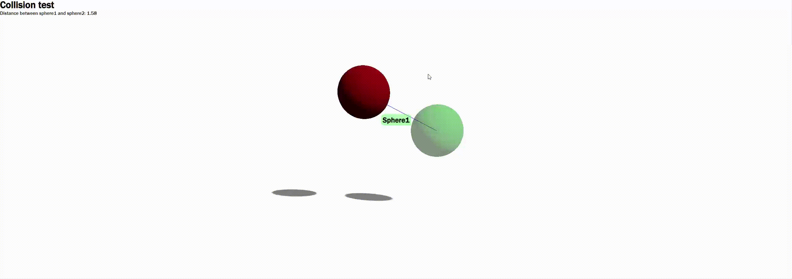

# Project Name: ThreeJS Sphere Collision

This project demonstrates the interaction between two spheres using Three.js library. One sphere can be controlled with the mouse, while the other sphere represents a static object for collision testing.

## Installation

1. Clone the repository: `git clone https://github.com/your-username/threejs-sphere-collision.git`
2. Navigate to the project directory: `cd threejs-sphere-collision`
3. Install dependencies: `npm install`

## Usage

1. Open your web browser executing an local serve with any visual studio code extension  
2. Use the mouse to control the movement of the first sphere
3. Observe the collision behavior between the two spheres

## Technologies Used

- Three.js: A JavaScript library for creating 3D graphics in the browser
- HTML5 Canvas: Used for rendering the spheres and handling user input

## Contributing

Contributions are welcome! If you have any ideas or improvements, please submit a pull request.

## License

This project is licensed under the MIT License. See the [LICENSE](LICENSE) file for more details.

  
## Demo

